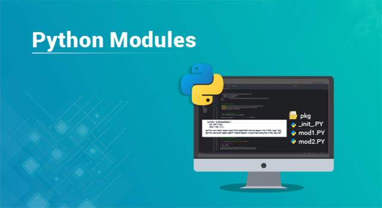
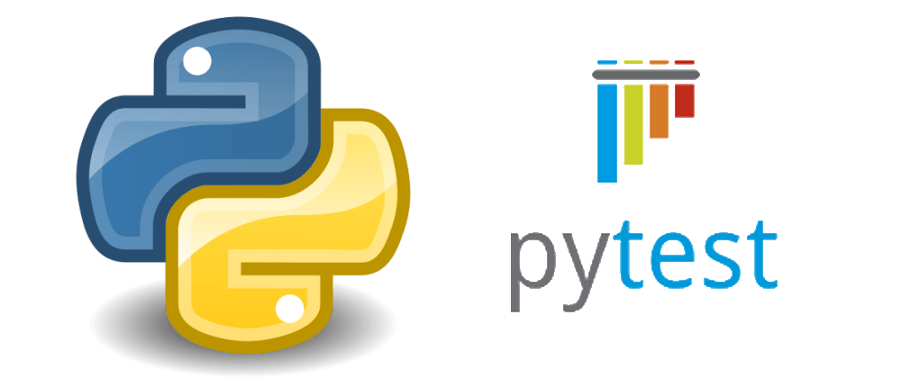

# Read: 02 - Readings: Testing and Modules

*Today Topic will be a about*
- Testing & Modules
- Recursion

## Python Modules and Packages

> What Is Python Modules:?




There are actually three different ways to define a module in Python:
  
  * A module can be written in Python itself.
  
  * A module can be written in C and loaded dynamically at run-time, like the re (regular expression)        module.
  
  * A built-in module is intrinsically contained in the interpreter, like the itertools module.
  
  ***import Statement***

 Module contents are made available to the caller with the import statement. The import statement takes        many different forms, shown below.

 ```
 import <module_name>
 ```
 ***dir() Function***

  The built-in function dir() returns a list of defined names in a namespace. Without arguments, it produces an alphabetically sorted list of names in the current local symbol table.

  

***Reloading a Module***

  For reasons of efficiency, a module is only loaded once per interpreter session. That is fine for function and class definitions, which typically make up the bulk of a module’s contents. But a module can contain executable statements as well, usually for initialization. Be aware that these statements will only be executed the first time a module is imported.
  ```
  >>> import mod
  a = [100, 200, 300]

  >>> import mod

  >>> import importlib
  >>> importlib.reload(mod)

  a = [100, 200, 300]
  ```

  ## pytest

> What Is Python pytest:?



The pytest framework makes it easy to write small tests, yet scales to support complex functional testing for applications and libraries.

 ***the advantages of pytest***

  * Very easy to start with because of its simple and easy syntax.

  * Can run tests in parallel.

  * Can run a specific test or a subset of tests

  * Automatically detect tests

  * Skip tests

  * Open source

## Recursion

> What is Recursion?


*The process in which a function calls itself directly or indirectly is called recursion and the corresponding function is called as recursive function. Using recursive algorithm, certain problems can be solved quite easily. Examples of such problems are Towers of Hanoi (TOH), Inorder/Preorder/Postorder Tree Traversals, DFS of Graph, etc.*

> What is base condition in recursion?

*In the recursive program, the solution to the base case is provided and the solution of the bigger problem is expressed in terms of smaller problems.*

```
int fact(int n)
{
    if (n < = 1) // base case
        return 1;
    else    
        return n*fact(n-1);    
}
```
*In the above example, base case for n < = 1 is defined and larger value of number can be solved by converting to smaller one till base case is reached.*

**How a particular problem is solved using recursion?** The idea is to represent a problem in terms of one or more smaller problems, and add one or more base conditions that stop the recursion. For example, we compute factorial n if we know factorial of (n-1). The base case for factorial would be n = 0. We return 1 when n = 0

```
// An example of direct recursion
void directRecFun()
{
    // Some code....

    directRecFun();

    // Some code...
}

// An example of indirect recursion
void indirectRecFun1()
{
    // Some code...

    indirectRecFun2();

    // Some code...
}
void indirectRecFun2()
{
    // Some code...

    indirectRecFun1();

    // Some code...
}

```


## Contact Info : 
**Please Feel Free To Contact Me When You Need help ^_^**
* [www.facebook.com/aghyadalbalkhi](www.facebook.com/aghyadalbalkhi)
* Email : aghyadalbalkhi@gmail.com