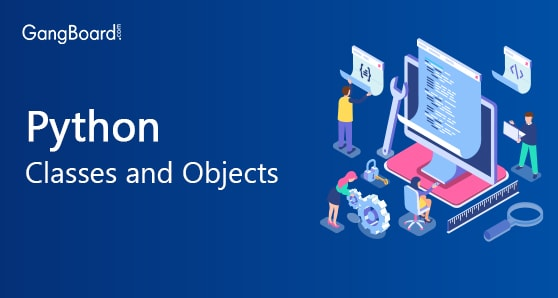
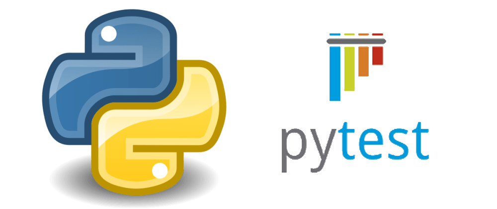

# Read: 04 - Readings: Classes and Objects and Thinking Recursively

*Today Topic will be a about*
- Testing & Modules
- Recursion

## Classes and Objects

> What Is Python Classes:?



*Python is a high-level objected oriented programming language meaning that most of the code in Python is implemented using classes. Classes are used to group related things together. By definition, a class is a template or blueprint for creating objects. It defines the methods and variables that are common to all objects of the same class.*

`objects are an instance of a class.`

**example of a car.**

*There are different types of cars which can be differentiated by distinct the attributes they have such as brand, model, color*

```
class Car: #class definition where Car is a class
def __init__(self, brand, model, color): #initializing a class
#Here, brand, model and color are general attributes of the class Car
self.brand = brand
self.model = model
self.color = color
car1 = Car("Ford", "Mustang", "Red") #car1 is an object with specific attributes
print(car1.brand) #accessing particular attribute(brand) of a specific object(car1)
print(car1.model) #accessing particular attribute(model) of a specific objectprint(car1.color) #accessing particular attribute(color) of a specific object
```
**Output**
```
Ford
Mustang
Red
```


***Accessing Object Variables and Functions :***

we can do it using myobjectx.variable

## Thinking recursively in python
   
   If the current problem represents a simple case, solve it. If not, divide it into subproblems and apply the same strategy to them.

   in python, a recursive function is a function that calls itself and repeats its behavior until some conditions are met to return a result all recursive functions share the same structure, a base case, and a recursive case

   Recursive function for calculating n! implemented in Python:
   ```
    def factorial_recursive(n):
    # Base case: 1! = 1
    if n == 1:
        return 1

    # Recursive case: n! = n * (n-1)!
    else:
        return n * factorial_recursive(n-1)
   ```

## Python Testing with pytest: Fixtures and Coverage



   Pytest is a robust Python testing tool, pytest can be used for all types and levels of software testing. pytest can be used by development teams, QA teams, independent testing groups, individuals practicing TDD, and open source projects. In fact, projects all over the Internet have switched from unittest or nose to pytest, including Mozilla and Dropbox. Why? Because pytest offers powerful features such as ‘assert‘ rewriting, a third-party plugin model, and a powerful yet simple fixture model that is unmatched in any other testing framework.

## pytest fixtures

- capfd: Capture, as text, output to file descriptors 1 and 2.

- capfdbinary: Capture, as bytes, output to file descriptors 1 and 2.

- caplog: Control logging and access log entries.

- capsys: Capture, as text, output to sys.stdout and sys.stderr.

- capsysbinary: Capture, as bytes, output to sys.stdout and sys.stderr.

- cache: Store and retrieve values across pytest runs.

- doctest_namespace: Provide a dict injected into the docstests namespace.

- monkeypatch: Temporarily modify classes, functions, dictionaries, os.environ, and other objects.

- pytestconfig: Access to configuration values, pluginmanager and plugin hooks.

- record_property: Add extra properties to the test.

- record_testsuite_property: Add extra properties to the test suite.

- recwarn: Record warnings emitted by test functions.

- request: Provide information on the executing test function.


**For More Info** [pytest](https://docs.pytest.org/en/stable/fixture.html)


## Contact Info : 
**Please Feel Free To Contact Me When You Need help ^_^**
* [www.facebook.com/aghyadalbalkhi](www.facebook.com/aghyadalbalkhi)
* Email : aghyadalbalkhi@gmail.com