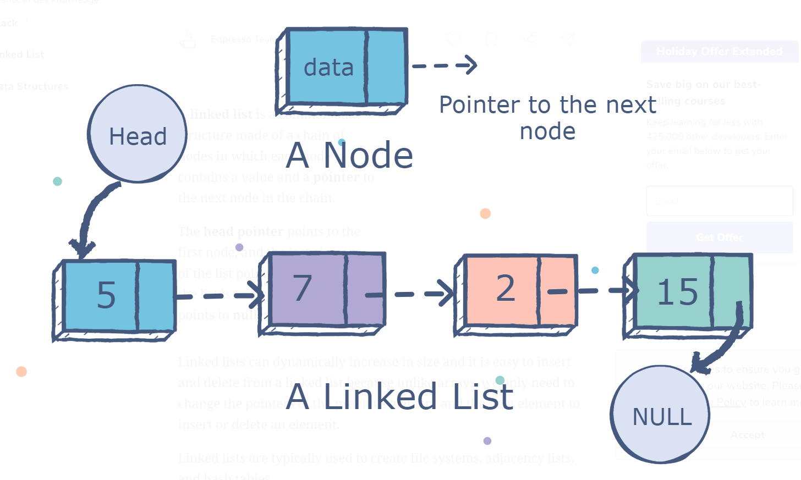
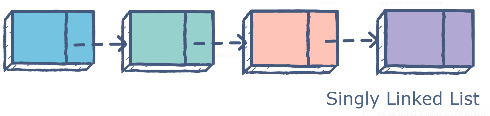
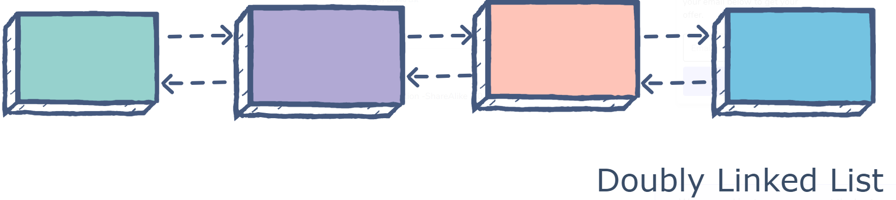

# Read: 05 - Readings: Read: Linked Lists

*Today Topic will be a about*
- Linked Lists

## Linked Lists

> What Is Linked Lists?



*A `linked list` is a common data structure made of a chain of nodes in which each node contains a value and a `pointer` to the next node in the chain.*

*The `head pointer` points to the first node, and the last element of the list points to `null`. When the list is empty, the head pointer points to null.*

**Types of Linked Lists**

- Singly Linked List 

- Doubly Linked List 

- Circular Linked List





**Demo Code** 

* Node Class
```
class Node:
    def __init__(self, value):
        self.value = value
        self.next = None
```

* Linked List 
*Empty Linked List*
```
class LinkedList:
    def __init__(self):
        self.head = None
        self.size = 0

```

**Big O**

- Average & Worst Case 
 * Search `O(N)`
 * Insetr `O(1)`
 * Delete  `O(1)`


## Contact Info : 
**Please Feel Free To Contact Me When You Need help ^_^**
* [www.facebook.com/aghyadalbalkhi](www.facebook.com/aghyadalbalkhi)
* Email : aghyadalbalkhi@gmail.com
