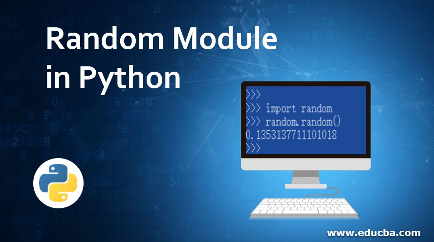
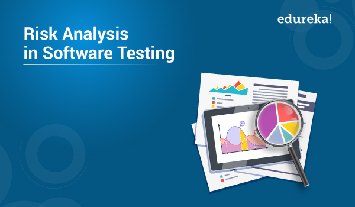

# Read: 06 - Readings: Readings: Game of Greed 1

*Today Topic will be a about*
- Random Module in Python
- Risk Analysis

## Random Module in Python

> What Is Random Module in Python?



*This module contain a functions that allow us to generate a random numbers*

**Random functions**

- Randint
    generate a random integer

```
import random
print random.randint(0, 5)

```
*output*

```
1, 2, 3, 4 or 5
```

**Choice**
*Generate a random value from the sequence sequence.*
*The choice function can often be used for choosing a random element from a list.*

**For Example**

```
import random
myList = [422, 109, 2424, 01, "4", 482, "77"]
random.choice(myList)
```

**Shuffle**

*shuffles the elements in list in place*

```
from random import shuffle
x = [[i] for i in range(10)]
shuffle(x)

```

**Randrange**
*Generate a randomly selected element from range(start, stop, step)*

```
import random
for i in range(3):
    print random.randrange(0, 101, 5)
```

[Resource Link](https://www.pythonforbeginners.com/random/how-to-use-the-random-module-in-python)

## Risk Analysis in Software Testing
> What is Risk Analysis in Software Testing ?




*Risk analysis is the process of identifying risks in applications and prioritizing them to test*

**Why ?**
*A risk analysis performed during software testing helps to identify areas where software flaws could result in serious issues in production. By identifying areas of concern early, developers are able to proactively remediate and reduce the overall risk of a production defect.*

**Risk Identification**

- Business Risks
- Testing Risks
- Premature Release Risk
- Software Risks

**The perspective of Risk Assessment**

* Effect
* Cause
* Likelihood

**Performming The Risk Analysis**

1- Searching the risk
2- Analyzing the impact of each individual risk
3- Measures for the risk identified


## Contact Info : 
**Please Feel Free To Contact Me When You Need help ^_^**
* [www.facebook.com/aghyadalbalkhi](www.facebook.com/aghyadalbalkhi)
* Email : aghyadalbalkhi@gmail.com