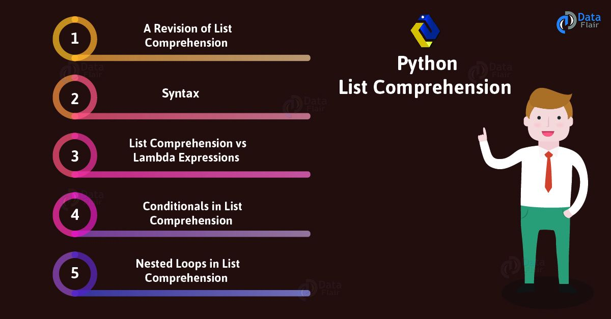
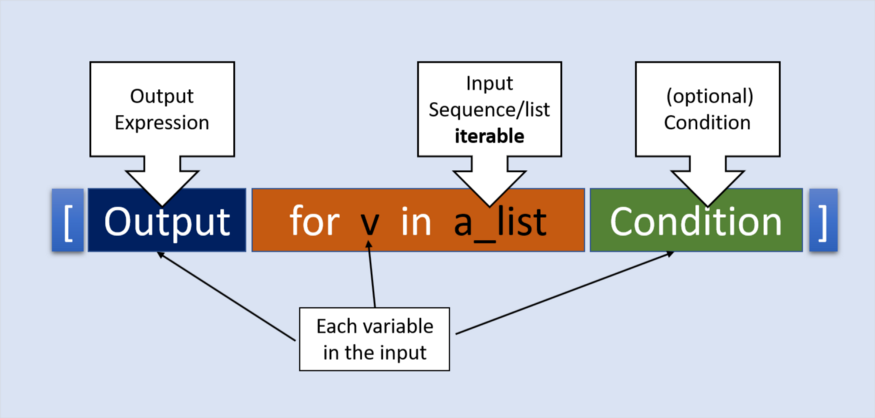
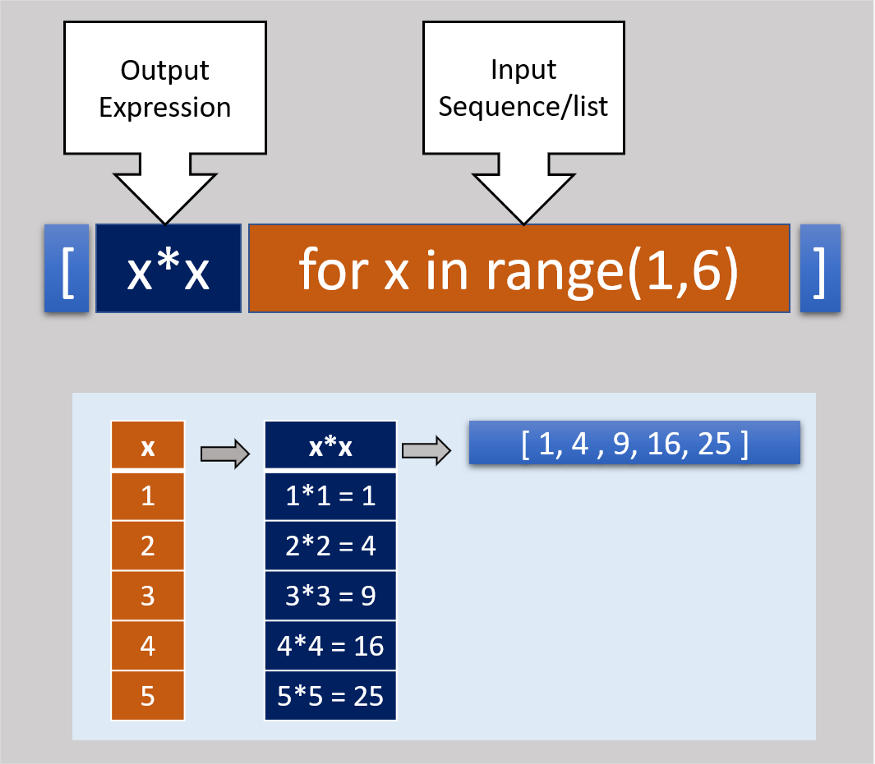
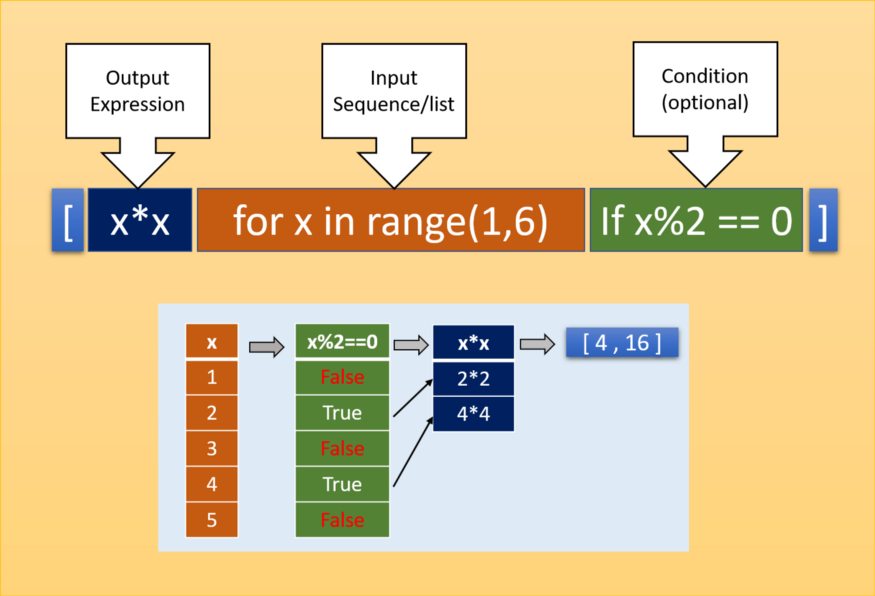

# Read: 08 - Readings: List Comprehensions in Python

*Today Topic will be a about*
- List Comprehensions

## Python List Comprehensions

> What Is List Comprehensions?



*List comprehensions provide us with a simple way to create a list based on some sequence or another list that we can loop over. In python terminology, anything that we can loop over is called iterable. At its most basic level, list comprehension is a syntactic construct for creating lists from existing lists. In the core of list comprehension, it is the loop (‘for’ loop).*

*List comprehension has these essential parts :*

- An iterable input sequence (this could be a list, a range, or any sequence) that we iterate using a variable name.
- An output expression
- An optional condition for the variable to filter or map or do some logical action




**For Example**
```
lst = [x*x for x in range(1,6)]    >>>> [1,4,9,16,25]
```

**break-down the list comprehension parts example**




**list comprehension condition**

```
lst = [x*x for x in range(1,6) if x%2 ==0 ]    >>>> [4,16]
```




**Advantages of List Comprehension**
* One of the significant advantages of list comprehension is that developer need to write less code
* List comprehension often becomes easier to understand
* The speed of list comprehensions is notably better than for-loops when appending items to the list
* List comprehensions are an excellent alternative to the built-in map and filter functions


## Contact Info : 
**Please Feel Free To Contact Me When You Need help ^_^**
* [www.facebook.com/aghyadalbalkhi](www.facebook.com/aghyadalbalkhi)
* Email : aghyadalbalkhi@gmail.com