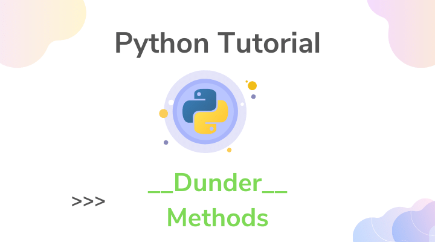
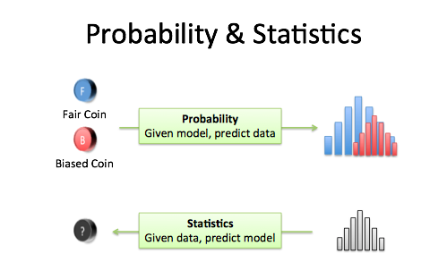

# Read: 02 - Readings: Dunder Methods & Statistics - Probability

*Today Topic will be a about*
- Dunder Methods
- Statistics - Probability

## Dunder Methods

> What Is Python Dunder Methods?



*In Python, special methods are a set of predefined methods you can use to enrich your classes. They are easy to recognize because they start and end with double underscores, for example init or str.*

*As it quickly became tiresome to say under-under-method-under-under Pythonistas adopted the term “dunder methods”, a short form of “double under.”*

*These “dunders” or “special methods” in Python are also sometimes called “magic methods.” But using this terminology can make them seem more complicated than they really are—at the end of the day there’s nothing “magical” about them. You should treat these methods like a normal language feature.*

**For Example**


`__repr__`: string representation of an object. This is how you would make an object of the class. The goal of `__repr__` is to be unambiguous.

`__str__`:string representation of an object. This is for the enduser.

```
nums = [1, 2, 3, 4, 5]
print(len(nums)) #5
print(nums.__len__()) #5
```
## Statistics - Probability

> What Is Python Statistics - Probability?



*At the most basic level, probability seeks to answer the question, What is the chance of an event happening? An event is some outcome of interest. To calculate the chance of an event happening, we also need to consider all the other events that can occur. The quintessential representation of probability is the humble coin toss. In a coin toss the only events that can happen are:*

1. Flipping a heads

1. Flipping a tails

*These two events form the sample space, the set of all possible events that can happen. To calculate the probability of an event occurring, we count how many times are event of interest can occur (say flipping heads) and dividing it by the sample space. Thus, probability will tell us that an ideal coin will have a 1-in-2 chance of being heads or tails. By looking at the events that can occur, probability gives us a framework for making predictions about how often events will happen. However, even though it seems obvious, if we actually try to toss some coins, were likely to get an abnormally high or low counts of heads every once in a while. If we dont want to make the assumption that the coin is fair, what can we do? We can gather data! We can use statistics to calculate probabilities based on observations from the real world and check how it compares to the ideal.*


## Contact Info : 
**Please Feel Free To Contact Me When You Need help ^_^**
* [www.facebook.com/aghyadalbalkhi](www.facebook.com/aghyadalbalkhi)
* Email : aghyadalbalkhi@gmail.com