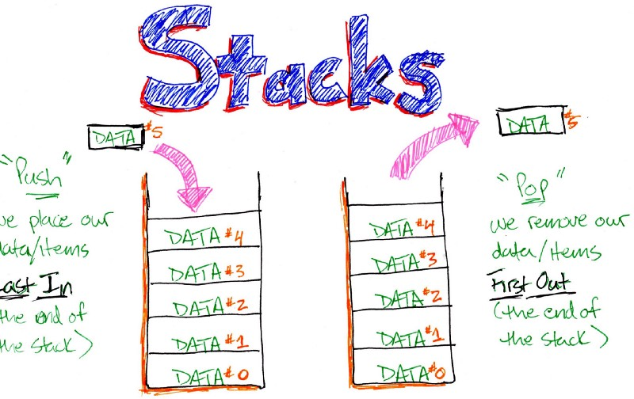
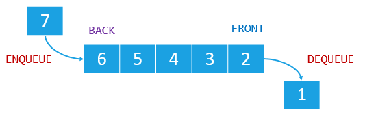

# Read: 02 - Readings: Stacks & Queues

*Today Topic will be a about*
- Stacks
- Queues

<br>


## Stacks

> What Is Stacks?



*A `Stack` is the most elemental of the data structures in computer science.*

*A `stack` is an abstract data structure that follows the "last-in-first-out" or LIFO model. Some real world examples are the "click to go back" to the previous web page, and text editor's undo feature.*

There are 3 basic operations on a stack:
1. `Push`: Insert a data item on the stack.
2. `Pop`: Remove an item from the top of the stack.
3. `Peek`: Read the value of an item from the top of the stack WITHOUT removing it.

**you can implement a stack using an array or a linked list.**

**For Example**
```
class StackX {
    private int maxSize;
    private long[] stackArray;
    private int top;

    public StackX(int s) {                // constructor
        maxSize = s;                      // set the array size
        stackArray = new long[maxSize];   // create an array
        top = -1;                         // no items yet
    }

    public void push(long j) {        // put items on top of the stack
        stackArray[++top] = j;        // increment top when item inserted
    }
    public long pop() {               // take item from the top of the stack
        return stackArray[top--];     // access item, then decrement top
    }
    public long peek() {              // peek at the top of the stack
        return stackArray[top];
    }
    public boolean isEmpty() {        // true if the stack is empty
        return (top == -1);
    }
    public boolean isFull() {         // true if the stack is full
        return (top == maxSize -1);
    }
```

**Stack Applications**
- reversing data; e.g. reversing a string
- parsing: breaks the data into independent pieces for further provessing; e.g. Check the delimiter matching [,{,(,),},].


## Queue

> What Is Queue?



*A `queue` is an abstract data structure that follows `"first-in-first-out"` or `FIFO` model. Some real world examples include printing a file (and there's a file in queue), process scheduler, a waiting line.*

Basic operations on a queue:
1. `Enque/Add/Put`: Insert a data item on the back or rear of the queue.
2. `Deque/Delete/Get`: Remove an item from the front of the queue.
3. `Peek`: Read the value of an item from the front of the queue without removing it.

**For Example**

```
class Queue {
    private int maxSize;
    private long[] queArray;
    private int front;
    private int back;
    private int nItems;

    public Queue(int s) {                    // Constructor
        maxSize = s;
        quaArray = new long[maxSize];
        front = 0;
        back = -1;
        nItems = 0;
    }

    public void insert(long j) {            // Put an item at the back of the queue
        if(back == maxSize -1) back = -1;   // Deal with wraparound
        queArray[++back] = j;               // Increment back and insert the item
        nItems++;                           // One more item
    }
    public long remove() {                  // Take item from the front of the queue
        long temp = queArray[front++];      // Get the item and increment front
        if(front == maxSize) front = 0;     // Deal with wraparound
        nItems--;                           // One less item
        return temp;
    }
    public long peekFront() {
        return queArray[front];
    }

```

For More Info and Resource
[Resource](https://dev.to/rinsama77/data-structure-stack-and-queue-4ecd)

## Contact Info : 
**Please Feel Free To Contact Me When You Need help ^_^**
* [www.facebook.com/aghyadalbalkhi](www.facebook.com/aghyadalbalkhi)
* Email : aghyadalbalkhi@gmail.com
