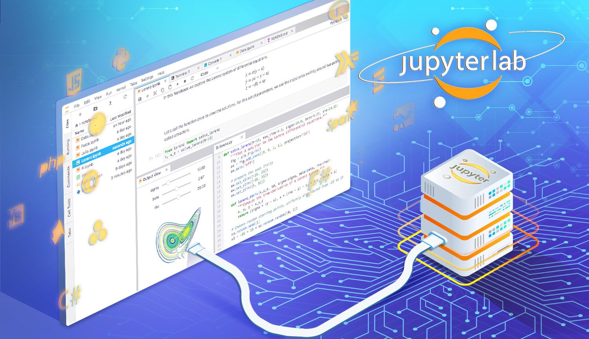
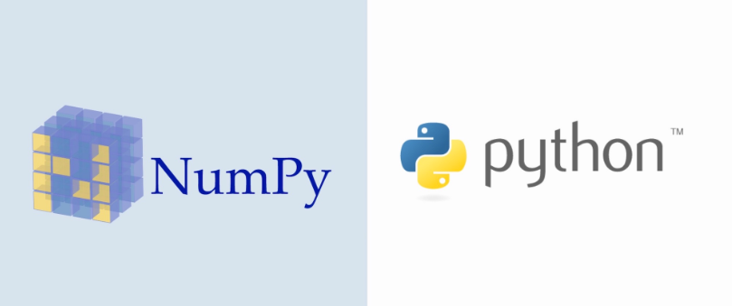

# Read: 11 - Readings: Data Analysis

*Today Topic will be a about*
- JupyterLab 
- NumPy 


## JupyterLab

> What Is JupyterLab?



*JupyterLab is a next-generation web-based user interface for Project Jupyter. JupyterLab enables you to work with documents and activities such as Jupyter notebooks, text editors, terminals, and custom components in a flexible, integrated, and extensible manner.*

**What is the use of Jupyter lab?**

*JupyterLab enables you to arrange your work area with notebooks, text files, terminals, and notebook outputs. JupyterLab provides a high level of integration between notebooks, documents, and activities: Drag-and-drop to reorder notebook cells and copy them between notebooks.*


## NumPy

> What Is NumPy?



*NumPy is a Python library used for working with arrays. It also has functions for working in domain of linear algebra, fourier transform, and matrices. NumPy was created in 2005 by Travis Oliphant. It is an open source project and you can use it freely. NumPy stands for Numerical Python.*

**What is the purpose of NumPy?**

*What is NumPy? NumPy is an open-source numerical Python library. NumPy contains a multi-dimensional array and matrix data structures. It can be utilised to perform a number of mathematical operations on arrays such as trigonometric, statistical, and algebraic routines.*

**How do I use NumPy in Python?**

*NumPy offers many ways to do array indexing. Slicing: Just like lists in python, NumPy arrays can be sliced. As arrays can be multidimensional, you need to specify a slice for each dimension of the array. Integer array indexing: In this method, lists are passed for indexing for each dimension*


**Installation of NumPy**

`pip install numpy`

*To Use Numpy we need to import it first*

```
import numpy as np

arr = np.array([1, 2, 3, 4, 5])

print(arr)
```


## Contact Info : 
**Please Feel Free To Contact Me When You Need help ^_^**
* [www.facebook.com/aghyadalbalkhi](www.facebook.com/aghyadalbalkhi)
* Email : aghyadalbalkhi@gmail.com