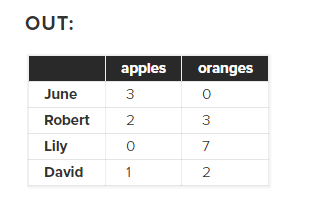

# Read: 12 - Readings: Pandas for Data Science

*Today Topic will be a about*
- Pandas 


## Python Pandas

> What Is Pandas?


*The pandas package is the most important tool at the disposal of Data Scientists and Analysts working in Python today. The powerful machine learning and glamorous visualization tools may get all the attention, but pandas is the backbone of most data projects.*

**What's Pandas for?**
*This tool is essentially your data’s home. Through pandas, you get acquainted with your data by cleaning, transforming, and analyzing it.*


**How does pandas fit into the data science toolkit?**

*Pandas is built on top of the NumPy package, meaning a lot of the structure of NumPy is used or replicated in Pandas. Data in pandas is often used to feed statistical analysis in SciPy, plotting functions from Matplotlib, and machine learning algorithms in Scikit-learn.*

*Jupyter Notebooks offer a good environment for using pandas to do data exploration and modeling, but pandas can also be used in text editors just as easily.*

**Core components of pandas: `Series` and `DataFrames`**

**The primary two components of pandas are the `Series` and `DataFrame.`**

*A `Series` is essentially a column, and a `DataFrame` is a multi-dimensional table made up of a collection of Series.*


*DataFrames and Series are quite similar in that many operations that you can do with one you can do with the other, such as filling in null values and calculating the mean.*

**Creating DataFrames from scratch**

*There are many ways to create a DataFrame from scratch, but a great option is to just use a simple `dict.`*

```
data = {
    'apples': [3, 2, 0, 1], 
    'oranges': [0, 3, 7, 2]
}
```

**then pass it to the pandas DataFrame constructor**

```
purchases = pd.DataFrame(data)

purchases

```


**So now we could `loc`ate a customer's order by using their name:**

```
purchases.loc['June']

```

**OUT**

```
apples     3
oranges    0
Name: June, dtype: int64
```

**For More Info** [learndatasci](https://www.learndatasci.com/tutorials/python-pandas-tutorial-complete-introduction-for-beginners/)


## Contact Info : 
**Please Feel Free To Contact Me When You Need help ^_^**
* [www.facebook.com/aghyadalbalkhi](www.facebook.com/aghyadalbalkhi)
* Email : aghyadalbalkhi@gmail.com