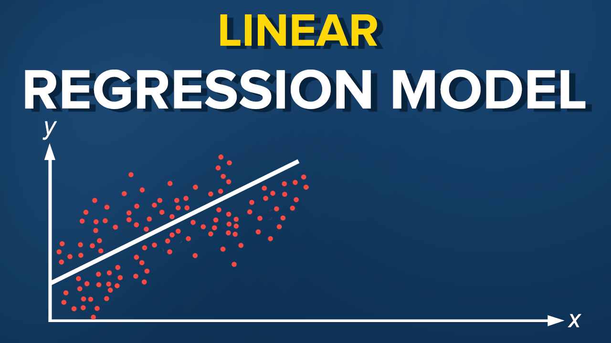

# Read: 13 - Readings: Linear Regressions

*Today Topic will be a about*
- Linear Regressions


## Linear Regressions

> What Is Linear Regressions?



*Linear regression is a linear approach to modelling the relationship between a scalar response and one or more explanatory variables (also known as dependent and independent variables). The case of one explanatory variable is called simple linear regression; for more than one, the process is called multiple linear regression.[1] This term is distinct from multivariate linear regression, where multiple correlated dependent variables are predicted, rather than a single scalar variable.*


**When Do You Need Regression Typically**

you need regression to answer whether and how some phenomenon influences the other or how several variables are related. For example, you can use it to determine if and to what extent the experience or gender impact salaries.

Regression is also useful when you want to forecast a response using a new set of predictors. For example, you could try to predict electricity consumption of a household for the next hour given the outdoor temperature, time of day, and number of residents in that household.

Regression is used in many different fields: economy, computer science, social sciences, and so on. Its importance rises every day with the availability of large amounts of data and increased awareness of the practical value of data.

**Linear regression in python**

*let’s import all the libraries and classes we need. We have a couple of new libraries/classes that we’ve not yet used, one for the linear regression model itself, and the other for plotting our results*

```
import numpy
import matplotlib.pyplot as plot
import pandas
from sklearn.model_selection import train_test_split
from sklearn.linear_model import LinearRegression

```

*we can split our data into training and test sets. The code for doing this is given below:*

```
# Import the dataset
dataset = pandas.read_csv('salaryData.csv')
x = dataset.iloc[:, :-1].values
y = dataset.iloc[:, 1].values

# Split the dataset into the training set and test set
# We're splitting the data in 1/3, so out of 30 rows, 20 rows will go into the training set,
# and 10 rows will go into the testing set.
xTrain, xTest, yTrain, yTest = train_test_split(x, y, test_size = 1/3, random_state = 0)

```
**Now Lets get our Linear regression*

```
linearRegressor = LinearRegression()

linearRegressor.fit(xTrain, yTrain)
```

*we can now start testing the model with the testing dataset you have.*

```
yPrediction = linearRegressor.predict(xTest)
```

## Contact Info : 
**Please Feel Free To Contact Me When You Need help ^_^**
* [www.facebook.com/aghyadalbalkhi](www.facebook.com/aghyadalbalkhi)
* Email : aghyadalbalkhi@gmail.com