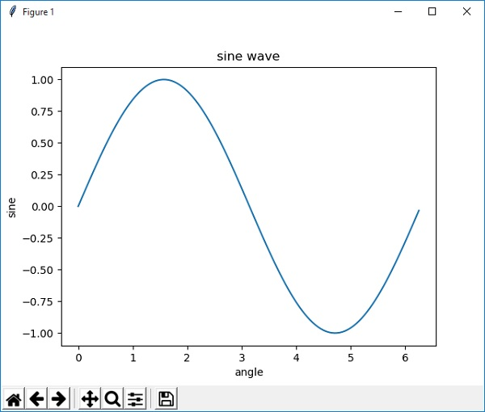

# Read: 14 - Readings: Data Visualization

*Today Topic will be a about*
- Data Visualization

## Python Data Visualization

> What Is Data Visualization?


*Data visualization is the discipline of trying to understand data by placing it in a visual context so that patterns, trends and correlations that might not otherwise be detected can be exposed.*

*Python offers multiple great graphing libraries that come packed with lots of different features. No matter if you want to create interactive, live or highly customized plots python has an excellent library for you.*

**a few popular plotting libraries:**

- Matplotlib: low level, provides lots of freedom
- Pandas Visualization: easy to use interface, built on Matplotlib
- Seaborn: high-level interface, great default styles
- ggplot: based on R’s ggplot2, uses Grammar of Graphics
- Plotly: can create interactive plots

**Matplotlib**


*Matplotlib is one of the most popular Python packages used for data visualization. It is a cross-platform library for making 2D plots from data in arrays. It provides an object-oriented API that helps in embedding plots in applications using Python GUI toolkits such as PyQt, WxPythonotTkinter. It can be used in Python and IPython shells, Jupyter notebook and web application servers also.*

**create a simple plot with Matplotlib**

*First we need to import Matplotlib and others libraries*

```
import matplotlib.pyplot as plt
import numpy as np

```

*We now obtain the ndarray object of angles between 0 and 2π using the arange() function from the NumPy library.*
```
x = np.arange(0, math.pi*2, 0.05)
```
*The ndarray object serves as values on x axis of the graph. The corresponding sine values of angles in x to be displayed on y axis are obtained by the following statement*
```
y = np.sin(x)
```
*The values from two arrays are plotted using the plot() function.*
```
plt.plot(x,y)
```
*You can set the plot title, and labels for x and y axes.*
```
plt.xlabel("angle")
plt.ylabel("sine")
plt.title('sine wave')
```
*The Plot viewer window is invoked by the show() function −*
```
plt.show()
```


## Contact Info : 
**Please Feel Free To Contact Me When You Need help ^_^**
* [www.facebook.com/aghyadalbalkhi](www.facebook.com/aghyadalbalkhi)
* Email : aghyadalbalkhi@gmail.com