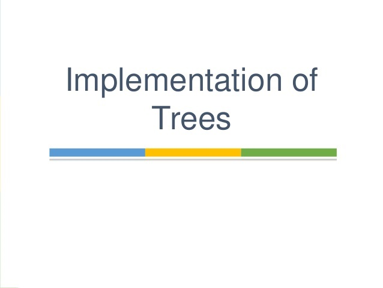

# Read: 15 - Readings: Implementation: Trees

*Today Topic will be a about*
- Trees

## Implementation: Trees

> What Is Trees?




*Tree represents the nodes connected by edges. We will discuss binary tree or binary search tree specifically.*

*Binary Tree is a special datastructure used for data storage purposes. A binary tree has a special condition that each node can have a maximum of two children. A binary tree has the benefits of both an ordered array and a linked list as search is as quick as in a sorted array and insertion or deletion operation are as fast as in linked list.*


*Following are the important `terms` with respect to tree.*

- Path Path refers to the sequence of nodes along the edges of a tree.

- Root The node at the top of the tree is called root. There is only one root per tree and one path from the root node to any node.

- `Parent` Any node except the root node has one edge upward to a node called parent.

- `Child` The node below a given node connected by its edge downward is called its child node.

- `Leaf` The node which does not have any child node is called the leaf node.

- `Subtree` Subtree represents the descendants of a node.

- `Visiting` Visiting refers to checking the value of a node when control is on the node.

- `Traversing` Traversing means passing through nodes in a specific order.

- `Levels` Level of a node represents the generation of a node. If the root node is at level 0, then its next child node is at level 1, its grandchild is at level 2, and so on.

- `keys` Key represents a value of a node based on which a search operation is to be carried out for a node.

**Tree Traversals**


*Unlike linear data structures (Array, Linked List, Queues, Stacks, etc) which have only one logical way to traverse them, trees can be traversed in different ways. Following are the generally used ways for traversing trees.*

*Depth First Traversals:* 
* Inorder (Left, Root, Right) : 4 2 5 1 3
* Preorder (Root, Left, Right) : 1 2 4 5 3
* Postorder (Left, Right, Root) : 4 5 2 3 1

**Inorder**
```
Algorithm Inorder(tree)
   1. Traverse the left subtree, i.e., call Inorder(left-subtree)
   2. Visit the root.
   3. Traverse the right subtree, i.e., call Inorder(right-subtree)

```
**Preorder**
```
Algorithm Preorder(tree)
   1. Visit the root.
   2. Traverse the left subtree, i.e., call Preorder(left-subtree)
   3. Traverse the right subtree, i.e., call Preorder(right-subtree) 

```
**Postorder**
```
Algorithm Postorder(tree)
   1. Traverse the left subtree, i.e., call Postorder(left-subtree)
   2. Traverse the right subtree, i.e., call Postorder(right-subtree)
   3. Visit the root.
```
**Binary Search Trees**


*is a node-based binary tree data structure which has the following properties:*
- The left subtree of a node contains only nodes with keys lesser than the node’s key.
- The right subtree of a node contains only nodes with keys greater than the node’s key.
- The left and right subtree each must also be a binary search tree.


## Contact Info : 
**Please Feel Free To Contact Me When You Need help ^_^**
* [www.facebook.com/aghyadalbalkhi](www.facebook.com/aghyadalbalkhi)
* Email : aghyadalbalkhi@gmail.com