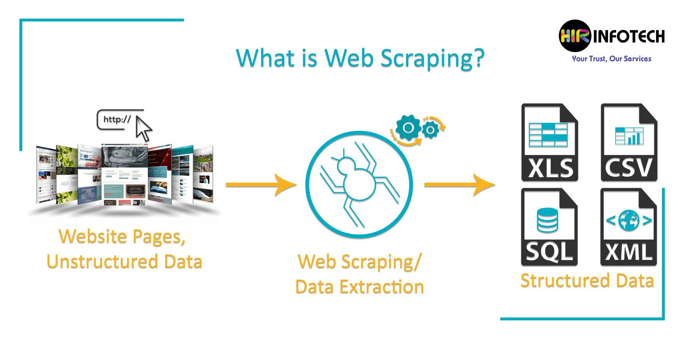

# Read: 17 - Readings: Web Scraping

*Today Topic will be a about Web Scraping*
- Web Scraping

##  Web Scraping

> What Is Web Scraping?



*Web scraping, also known as screen scraping, generally refers to the process of extracting, copying, saving and reusing third-party content on the internet*

**How does web scraping work?**

- Manual scraping
*It is a fact that both content and parts of the source code of websites are sometimes copied by hand. Criminals on the internet resort to this method particularly when bots and other scraping programs are blocked by the robots.txt file.*

- Software tools 
*Web scraping tools such as Scraper API, ScrapeSimple and Octoparse enable the creation of web scrapers even by those with little to no programming knowledge. Developers also use these tools as the basis for developing their own scraping solutions.*

- HTML parser 
*HTML parsers familiar from browsers are used in web scraping to extract and parse the content sought after.*

**Use and areas of application**

*Web scraping is employed in many different areas. It is always used for data extraction, often for completely legitimate purposes, but misuse is also common practice.*

* Search engine web crawlers
* Replacement for web services
* Remixing

**How can companies block web scraping?**

*There are a few measures that prevent a website from being subject to scraping:*

- Bot management
- robots.txt
- Captcha prompts
- Firewall

**Web Scrape with Python**
*steps to do web scraping with python*
- get the element name through `Inspecting web page`
-importing the libraries 
```
import requests
import urllib.request
import time
from bs4 import BeautifulSoup
```

- access the website through the URL 
```
url = 'http://web.mta.info/developers/turnstile.html'
response = requests.get(url)
```

- parsing the html with BeautifulSoup

```
soup = BeautifulSoup(response.text, “html.parser”)

```

- use the method .findAll to locate all of our element tags where This code gives us every line of code that has an <a> tag

```
soup.findAll('a')
```
- extract the actual link that we want
```
one_a_tag = soup.findAll(‘a’)[38]
link = one_a_tag[‘href’]
```

```
download_url = 'http://web.mta.info/developers/'+ link
urllib.request.urlretrieve(download_url,'./'+link[link.find('/turnstile_')+1:])
```

- pause  code for not spamming the website with requests

```
time.sleep(1)

```

## Contact Info : 
**Please Feel Free To Contact Me When You Need help ^_^**
* [www.facebook.com/aghyadalbalkhi](www.facebook.com/aghyadalbalkhi)
* Email : aghyadalbalkhi@gmail.com