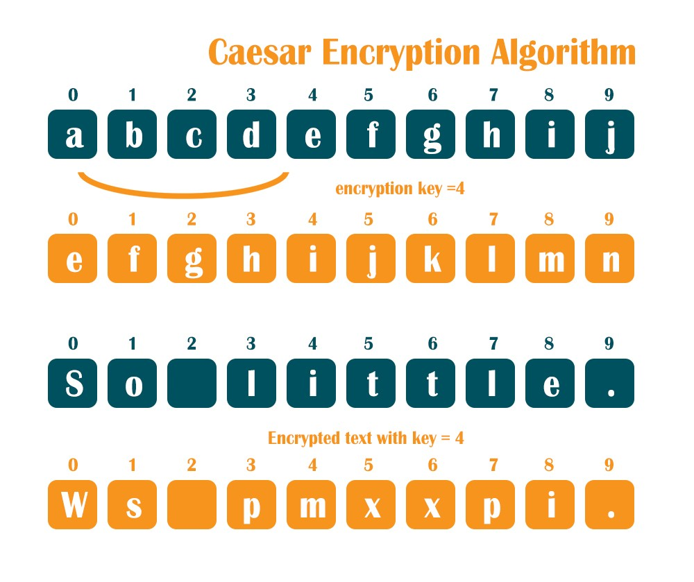
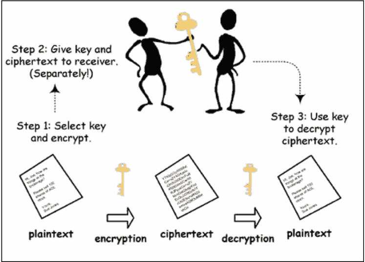

# Read: 18 - Readings: Readings: Cryptography

*Today Topic will be a about Readings: Cryptography*
- Ceasar Cipher
- Cryptography

##  Readings: Cryptography

> What Is Ceasar Cipher?



*Caesar Cipher is one of the earliest encryption methods and it works by shifting the characters in the alphabet with a certain key.for example, If the key is 4, then A becomes E*

*In caesar cipher, the key is the number represent the shiftting characters where both the sender and receiver must have the same key*



**Caesar Cipher: Example**

Encryption : (k ==3)

```
zhofrph wr sbwkrq frxuvh
```


Decryption : (k ==3)
```
welcome to python course
```
**Weaknesses**
- can easily broken

> What Is Cryptography?

*A cryptographic algorithm, or cipher, is the mathematical function used for encryption/decryption.*


There are two types of encryption:
* Symmetric 
* Asymmetric 

**Symmetric**


*The sender and the recipient have the same secret key that is used to encrypt and decrypt all the messages*

**Asymmetric**


*The sender and the recipient have the same secret key that is used to encrypt and decrypt all the messages*

 *Asymmetric encryption uses two keys to encrypt a plain text. Secret keys are exchanged over the Internet or a large network. It ensures that malicious persons do not misuse the keys.*


## Contact Info : 
**Please Feel Free To Contact Me When You Need help ^_^**
* [www.facebook.com/aghyadalbalkhi](www.facebook.com/aghyadalbalkhi)
* Email : aghyadalbalkhi@gmail.com