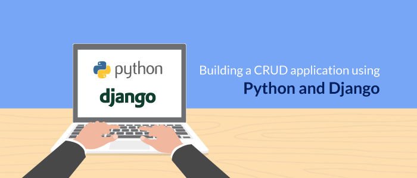

# Read: 28 - Readings: Django CRUD and Forms

*Today Topic will be a about*
- Django
- Forms

## Django CRUD

> What Is Django CRUD?


*Django is a Python-based web framework which allows you to quickly create web application without all of the installation or dependency problems that you normally will find with other frameworks. Django is based on MVT (Model View Template) architecture and revolves around CRUD (Create, Retrieve, Update, Delete) operations. CRUD can be best explained as an approach to building a Django web application. In general CRUD means performing Create, Retrieve, Update and Delete operations on a table in a database. Let’s discuss what actually CRUD means,*

- `Create` – create or add new entries in a table in the database.
- `Retrieve` – read, retrieve, search, or view existing entries as a list(List View) or retrieve a particular entry in detail (Detail View)
- `Update` – update or edit existing entries in a table in the database
- `Delete` – delete, deactivate, or remove existing entries in a table in the database


*After you have a project and an app, let’s create a model of which we will be creating instances through our view.*

```
# import the standard Django Model 
# from built-in library 
from django.db import models 

# declare a new model with a name "GeeksModel" 
class GeeksModel(models.Model): 

	# fields of the model 
	title = models.CharField(max_length = 200) 
	description = models.TextField() 

	# renames the instances of the model 
	# with their title name 
	def __str__(self): 
		return self.title 

```

*After creating this model, we need to run two commands in order to create Database for the same.*

```
Python manage.py makemigrations
Python manage.py migrate
```

*Now we will create a Django ModelForm for this model*

```
from django import forms 
from .models import GeeksModel 


# creating a form 
class GeeksForm(forms.ModelForm): 

	# create meta class 
	class Meta: 
		# specify model to be used 
		model = GeeksModel 

		# specify fields to be used 
		fields = [ 
			"title", 
			"description", 
		] 


```
*Create View refers to a view (logic) to create an instance of a table in the database.*

```
from django.shortcuts import render 

# relative import of forms 
from .models import GeeksModel 
from .forms import GeeksForm 


def create_view(request): 
	# dictionary for initial data with 
	# field names as keys 
	context ={} 

	# add the dictionary during initialization 
	form = GeeksForm(request.POST or None) 
	if form.is_valid(): 
		form.save() 
		
	context['form']= form 
	return render(request, "create_view.html", context) 

```


*Create a template*

```
<form method="POST" enctype="multipart/form-data"> 

	<!-- Security token -->

	<!-- Using the formset -->
	{{ form.as_p }} 
	
	<input type="submit" value="Submit"> 
</form> 

```
**Create View** 
refers to a view (logic) to create an instance of a table in the database.*

```
from django.shortcuts import render 

# relative import of forms 
from .models import GeeksModel 
from .forms import GeeksForm 


def create_view(request): 
	# dictionary for initial data with 
	# field names as keys 
	context ={} 

	# add the dictionary during initialization 
	form = GeeksForm(request.POST or None) 
	if form.is_valid(): 
		form.save() 
		
	context['form']= form 
	return render(request, "create_view.html", context) 

```

**Retrieve View**
*Retrieve view is basically divided into two types of views Detail View and List View.*

```
from django.shortcuts import render 

# relative import of forms 
from .models import GeeksModel 


def list_view(request): 
	# dictionary for initial data with 
	# field names as keys 
	context ={} 

	# add the dictionary during initialization 
	context["dataset"] = GeeksModel.objects.all() 
		
	return render(request, "list_view.html", context) 

```

**Update View**

*Update View refers to a view (logic) to update a particular instance of a table from the database with some extra details*

```
from django.shortcuts import (get_object_or_404, 
							render, 
							HttpResponseRedirect) 

# relative import of forms 
from .models import GeeksModel 
from .forms import GeeksForm 

# after updating it will redirect to detail_View 
def detail_view(request, id): 
	# dictionary for initial data with 
	# field names as keys 
	context ={} 

	# add the dictionary during initialization 
	context["data"] = GeeksModel.objects.get(id = id) 
		
	return render(request, "detail_view.html", context) 

# update view for details 
def update_view(request, id): 
	# dictionary for initial data with 
	# field names as keys 
	context ={} 

	# fetch the object related to passed id 
	obj = get_object_or_404(GeeksModel, id = id) 

	# pass the object as instance in form 
	form = GeeksForm(request.POST or None, instance = obj) 

	# save the data from the form and 
	# redirect to detail_view 
	if form.is_valid(): 
		form.save() 
		return HttpResponseRedirect("/"+id) 

	# add form dictionary to context 
	context["form"] = form 

	return render(request, "update_view.html", context) 


```


## Contact Info : 
**Please Feel Free To Contact Me When You Need help ^_^**
* [www.facebook.com/aghyadalbalkhi](www.facebook.com/aghyadalbalkhi)
* Email : aghyadalbalkhi@gmail.com