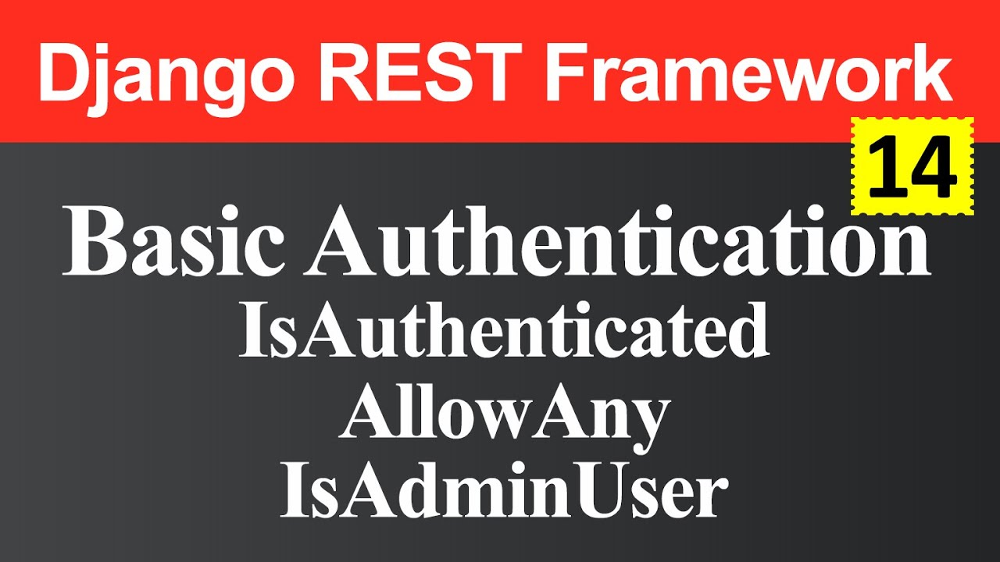

# Read: 32 - Readings: Permissions & Postgresql


*Today Topic will be a about*
- Permissions
- Postgresql

> What Is Django DRF Permissions?




*In DRF We can use the permissions to implement RBAC (Role-Based Access Control). Role-Based Access Control is an approach that restricts access to users based on their role. You can use Django’s authentication and authorization features to configure Role-Based Access Control.*

*Django user authentication has built-in models like User, Group, and Permission.*

- User: The heart of authentication
- Group: Way of categorizing User
- Permission: Granular access control

`Together with authentication and throttling, permissions determine whether a request should be granted or denied access.`

**How permissions are determined**
`Permissions in REST framework are always defined as a list of permission classes.`

When the permissions checks fail either a "403 Forbidden" or a "401 Unauthorized" response will be returned, according to the following rules:

* The request was successfully authenticated, but permission was denied. — An HTTP 403 Forbidden response will be returned.
* The request was not successfully authenticated, and the highest priority authentication class does not use WWW-Authenticate headers. — An HTTP 403 Forbidden response will be returned.
* The request was not successfully authenticated, and the highest priority authentication class does use WWW-Authenticate headers. — An HTTP 401 Unauthorized response, with an appropriate WWW-Authenticate header will be returned.

**Setting the permission policy**

thats done by adding the folowing code in setting.py file : 

```
REST_FRAMEWORK = {
    'DEFAULT_PERMISSION_CLASSES': [
        'rest_framework.permissions.IsAuthenticated',
    ]
}
```

`If not specified, this setting defaults to allowing unrestricted access:`

```
'DEFAULT_PERMISSION_CLASSES': [
   'rest_framework.permissions.AllowAny',
]
```

*You can also set the authentication policy on a per-view, or per-viewset basis, using the APIView class-based views.*

```
from rest_framework.permissions import IsAuthenticated
from rest_framework.response import Response
from rest_framework.views import APIView

class ExampleView(APIView):
    permission_classes = [IsAuthenticated]

    def get(self, request, format=None):
        content = {
            'status': 'request was permitted'
        }
        return Response(content)
```

**API Reference**

* AllowAny
* IsAuthenticated
* IsAdminUser
* IsAuthenticatedOrReadOnly

**Custom permissions**

To implement a custom permission, override BasePermission and implement either, or both, of the following methods:

* .has_permission(self, request, view)
* .has_object_permission(self, request, view, obj)

## Contact Info : 
**Please Feel Free To Contact Me When You Need help ^_^**
* [www.facebook.com/aghyadalbalkhi](www.facebook.com/aghyadalbalkhi)
* Email : aghyadalbalkhi@gmail.com