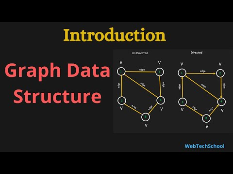
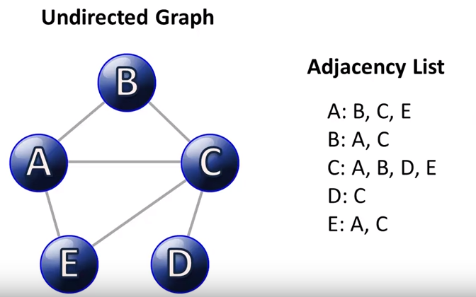
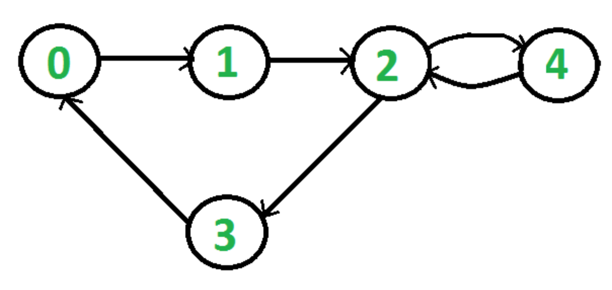
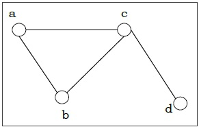
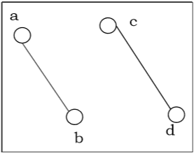

# Read: Graph - DSA

*Today Topic will be a about*
- Graph

*A graph is a non-linear data structure that can be looked at as a collection of vertices (or nodes) potentially connected by line segments named edges.*

* The nodes are sometimes also referred to as vertices and the edges are lines or arcs that connect any two nodes in the graph*

*Graphs are used to solve many real-life problems. Graphs are used to represent networks. The networks may include paths in a city or telephone network or circuit network. Graphs are also used in social networks like linkedIn, Facebook. For example, in Facebook, each person is represented with a vertex(or node). Each node is a structure and contains information like person id, name, gender, locale etc.*

Here is some common terminology used when working with Graphs:

- `Vertex` - A vertex, also called a “node”, is a data object that can have zero or more adjacent vertices.
- `Edge` - An edge is a connection between two nodes.
- `Neighbor` - The neighbors of a node are its adjacent nodes, i.e., are connected via an edge.
- `Degree` - The degree of a vertex is the number of edges connected to that vertex.

> Directed and Undirected Graphs

`Undirected graphs` have edges that do not have a direction. The edges indicate a two-way relationship, in that each edge can be traversed in both directions. This figure shows a simple undirected graph with three nodes and three edges.

`Directed graphs` have edges with direction. The edges indicate a one-way relationship, in that each edge can only be traversed in a single direction. This figure shows a simple directed graph with three nodes and two edges.

**Connected vs Disconnected Graphs**

- Connected Graph
*A graph is connected if any two vertices of the graph are connected by a path.*

- Disconnected Graph
A graph is disconnected if at least two vertices of the graph are not connected by a path. If a graph G is disconnected, then every maximal connected subgraph of G is called a connected component of the graph G

## Contact Info : 
**Please Feel Free To Contact Me When You Need help ^_^**
* [www.facebook.com/aghyadalbalkhi](www.facebook.com/aghyadalbalkhi)
* Email : aghyadalbalkhi@gmail.com

